# Introduction to Robotics (2023 - 2024) 

Dear reader,

Hello there, this will be the repo where I will upload all the homework in the discipline *Introduction to Robotics*, a dear subject to me that I attended in my 3rd year at *the Faculty of Mathematics and Computer Science, University of Bucharest*. For each homework, I will provide a well-explained code, alongside the task requirements, and the result presented in image files and a video.

Thank you very much for reading this,
 
 George🎯

P.S.

__*Bad coding style + No safety glasses in lab = Bad grade*__

## [Homework 2](https://github.com/GeorgePopescu318/IntroductionToRobotics/tree/main/Homework2)

Task:

Use a separate potentiometer for controlling each color of the RGB LED:Red,Green, andBlue.  This control must leveragedigital electronics.  Specifically,you  need  to  read  the  potentiometer`s  value  with  Arduino  and  then  write  amapped value to the LED pins.

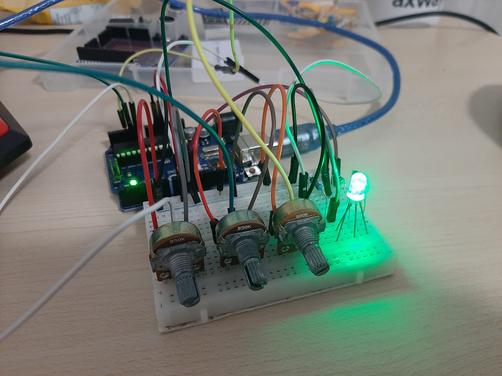    
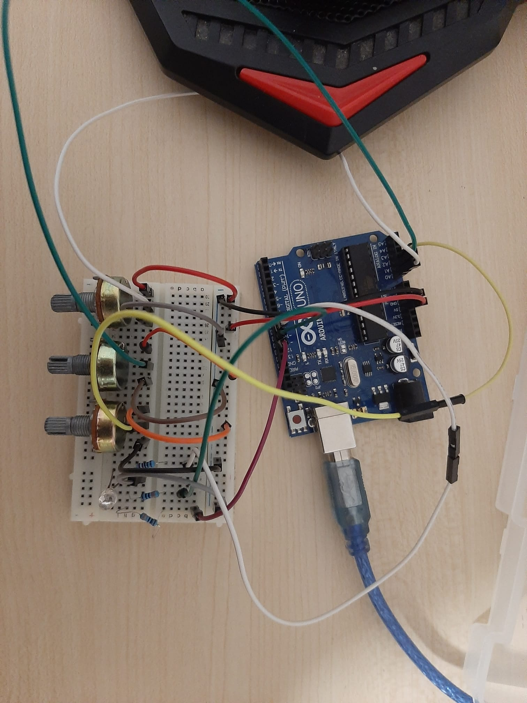    
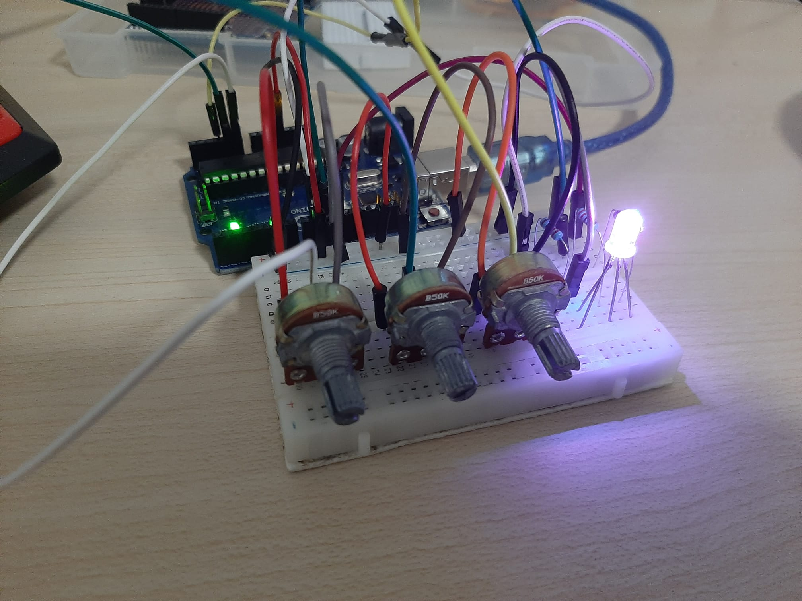  
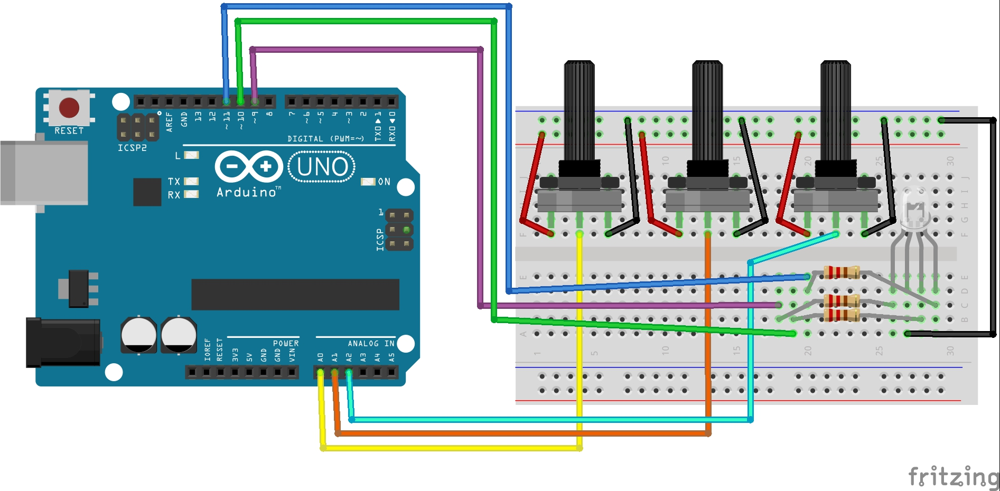  

[__Link to the video__](https://drive.google.com/file/d/1RaZQQeRdR0XG1Q5-4MOC7L5BarMdzbdl/view?usp=sharing)

## [Homework 3](https://github.com/GeorgePopescu318/IntroductionToRobotics/tree/main/Homework3)

Task:

This  assignment  involves  simulating  a  3-floor  elevator  control  system  usingLEDs, buttons, and a buzzer with Arduino. By the end of this task, you will gainexperience in using button state change, implementing debouncing techniques,and coordinating multiple components to represent real-world scenarios.
 
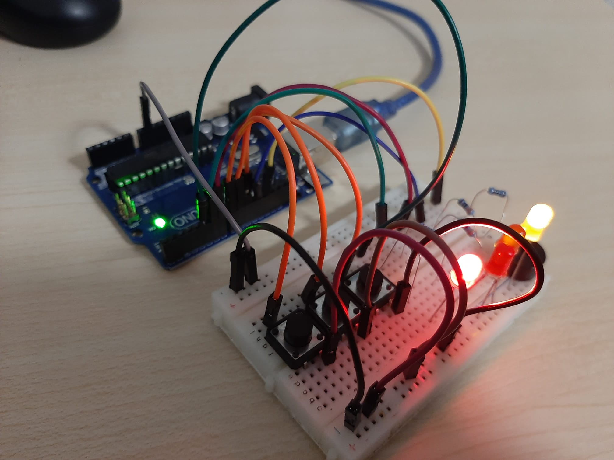    
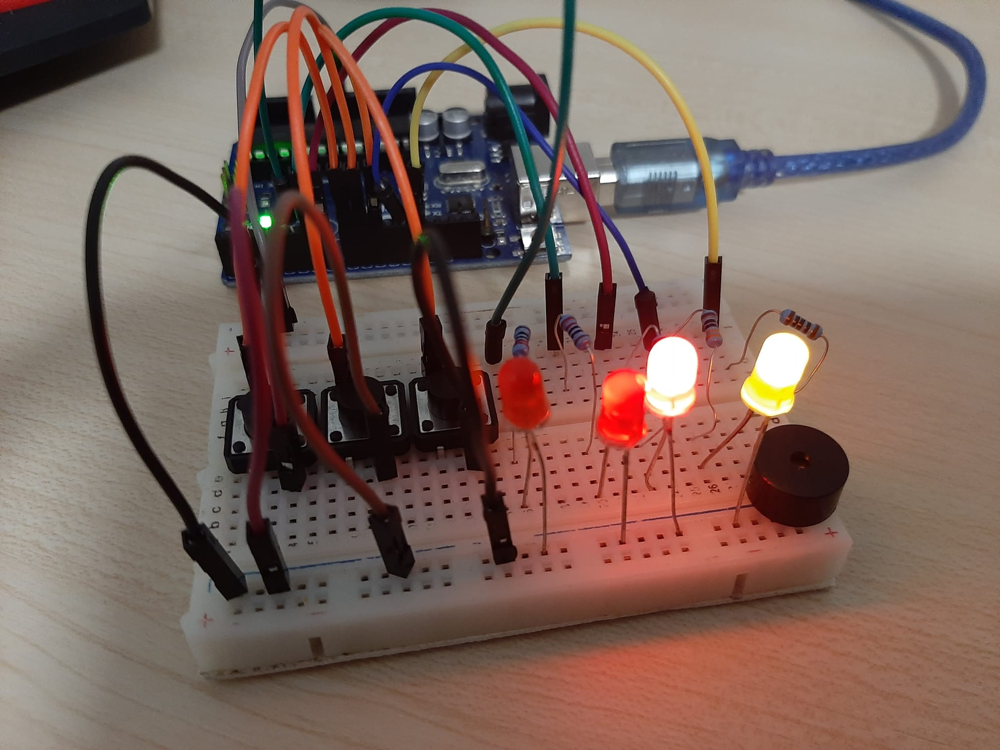    
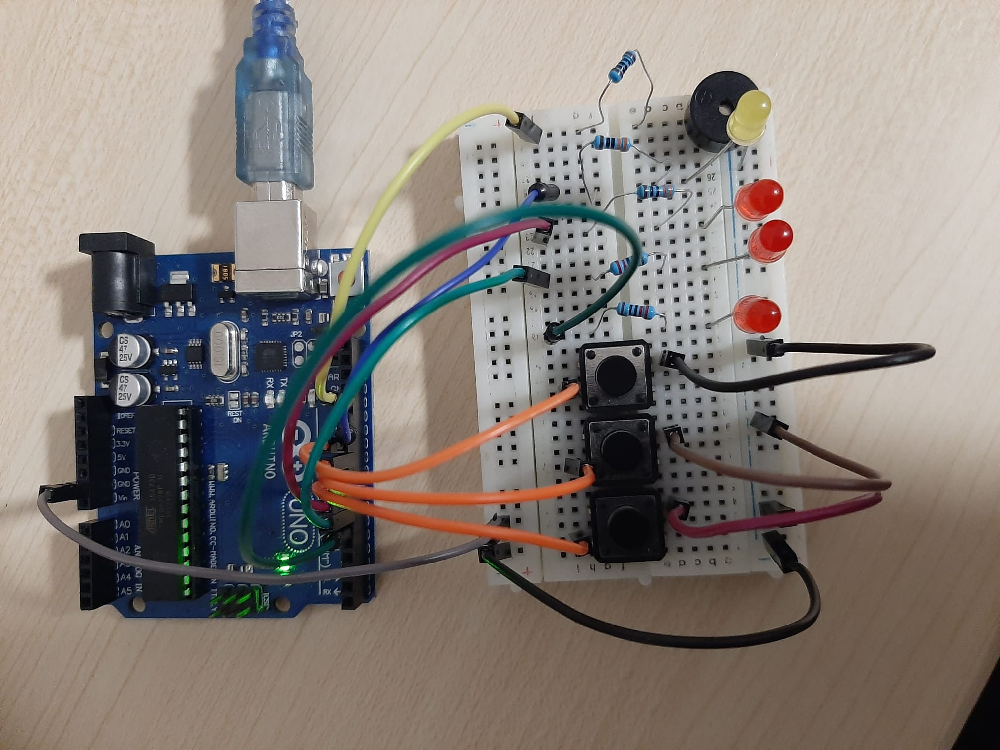  

[__Link to the video__](https://drive.google.com/file/d/1qiQeKAuW0VKCbqdy7o0GvTWo43vfWPNA/view?usp=sharing)

## [Homework 4](https://github.com/GeorgePopescu318/IntroductionToRobotics/tree/main/Homework4)

Description:

The following code allows you to move through a 7-segment Display using a joystick, the current LED segment will blink so you know where you are,
  additionally by short pressing the joystick/an external button the current segment will turn HIGH after you move your current segment from it, and you can turn them LOW if you
  short press again. By long pressing the joystick/button all the HIGH segments will turn LOW and the current segment will return to dp (decimal point).
 
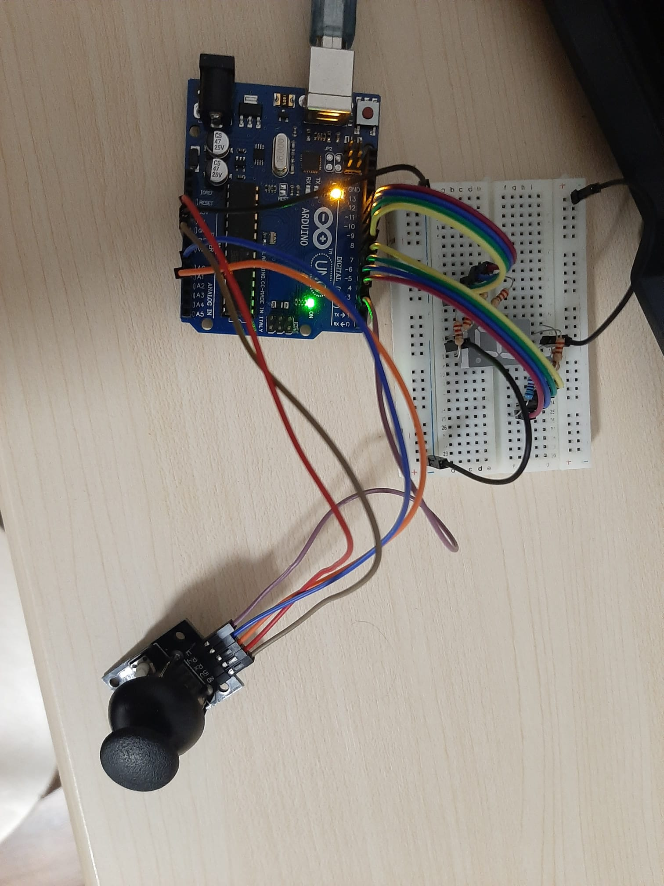    
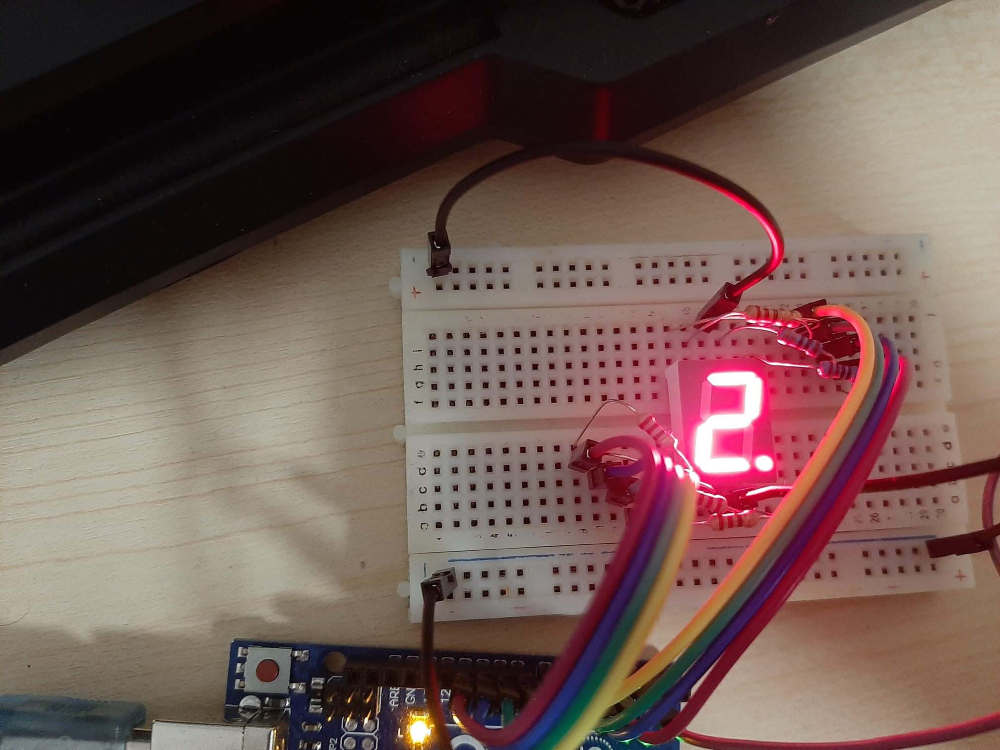    
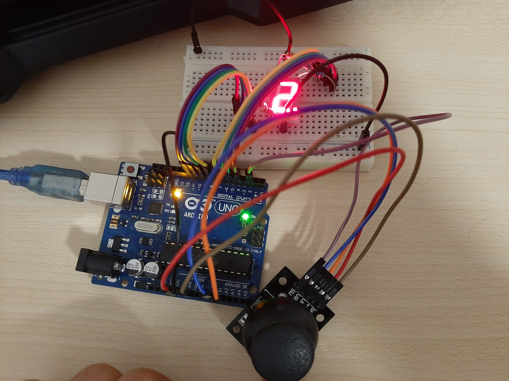  

[__Link to the video__](https://drive.google.com/file/d/1swsIln1Z-k-dDYYwCO2j6CUZ5jYW_hVP/view?usp=drive_link)

## [Homework 5](https://github.com/GeorgePopescu318/IntroductionToRobotics/tree/main/Homework5)

Description:

Meet the Arduino Uno Stopwatch – a high-tech timekeeper blending an Arduino Uno microcontroller, a space-efficient shift register, four vibrant 7-segment displays, and three user-friendly buttons. This stopwatch excels in accuracy and aesthetics, with streamlined design and precise time tracking of minutes, seconds, and tenths of a second. Perfect for athletes, professionals, or tech enthusiasts seeking a superior timekeeping experience.
 
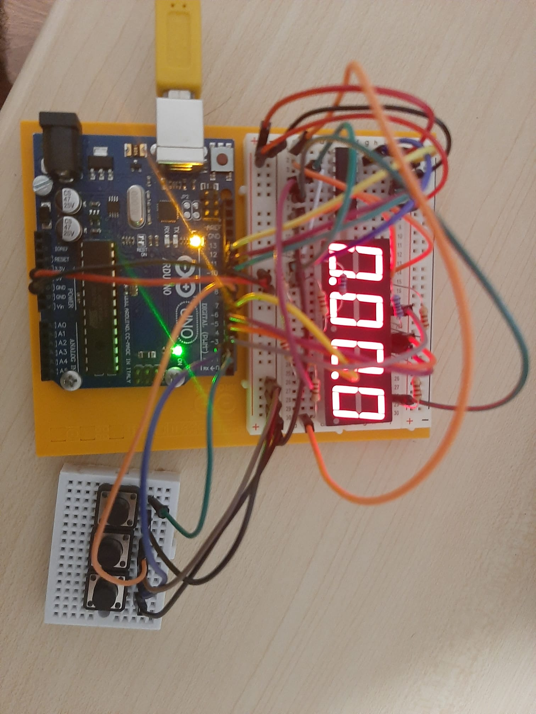    
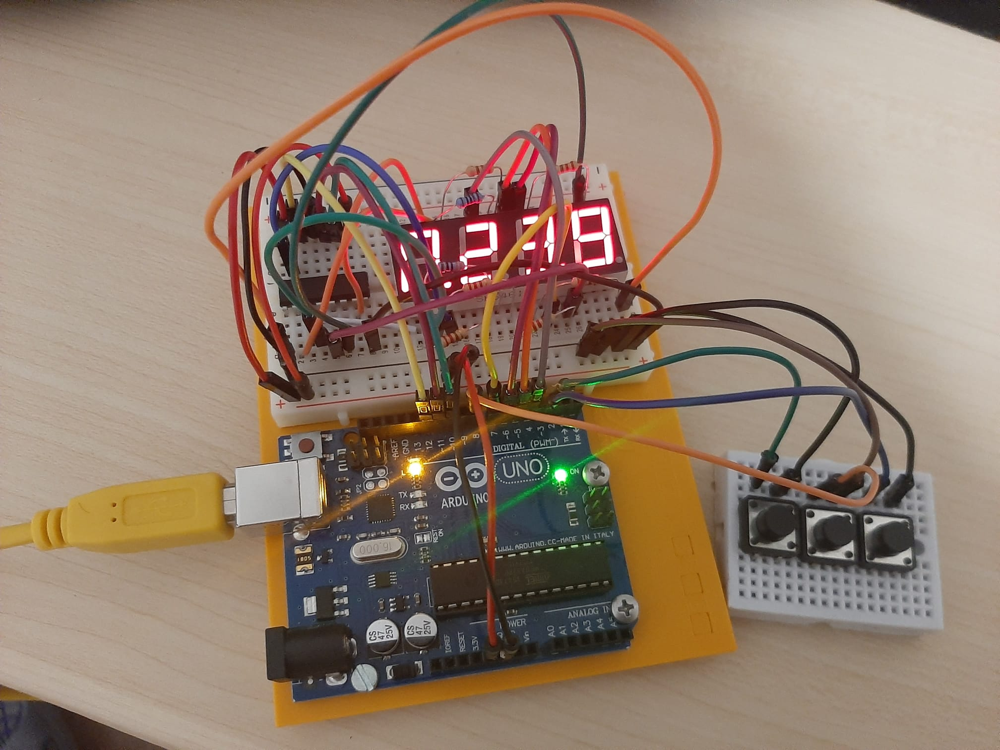    

[__Link to the video__](https://drive.google.com/file/d/1swsIln1Z-k-dDYYwCO2j6CUZ5jYW_hVP/view?usp=drive_link)